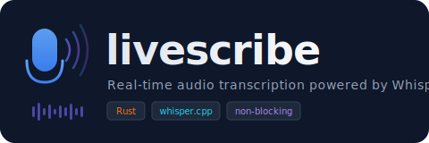

<p align="center">
  
</p>

<p align="center">
  <a href="#installation"><strong>Install</strong></a> &middot;
  <a href="#listen-speech-to-text"><strong>Listen</strong></a> &middot;
  <a href="#speak-text-to-speech"><strong>Speak</strong></a> &middot;
  <a href="#ai-rewrite"><strong>AI Rewrite</strong></a> &middot;
  <a href="#architecture"><strong>Architecture</strong></a>
</p>

<p align="center">
  
  
  
</p>

---

An AI-powered audio toolkit built in Rust. **Listen** to transcribe speech in real-time. **Speak** to turn any document into a natural-sounding audiobook, with optional LLM narration that rewrites raw text into something a human would actually want to hear.

## Features

- **Listen**: Real-time speech-to-text via [whisper.cpp](https://github.com/ggerganov/whisper.cpp) with non-blocking capture, overlapping chunks, and automatic deduplication
- **Speak**: Read documents aloud (.txt, .md, .pdf) with neural TTS ([Piper](https://github.com/rhasspy/piper) or [Chatterbox](https://github.com/resemble-ai/chatterbox))
- **AI Rewrite**: `--rewrite` sends your document through Claude to adapt it for narration — diagrams become descriptions, headings become transitions, lists become prose, and natural pauses are inserted between sections
- **Two TTS engines**: Piper (fast, native Rust, no Python) or Chatterbox (state-of-the-art quality, voice cloning, auto-managed Python venv)
- **Auto model download**: All models downloaded from HuggingFace on first run and cached locally
- **Cross-platform**: macOS (CoreAudio), Linux (ALSA), Windows (WASAPI) via cpal
- **GPU acceleration**: Optional Metal (macOS), CUDA (NVIDIA), and CoreML support

## Quick Start

```bash
# One-line install (macOS ARM64, Linux x64)
curl -fsSL https://raw.githubusercontent.com/nonatofabio/livescribe/main/install.sh | sh

# Or build from source
cargo install --path .

# Transcribe a meeting in real-time
livescribe listen

# Read a PDF aloud
livescribe speak paper.pdf

# Read a PDF with AI narration (diagrams described, natural pacing)
livescribe speak paper.pdf --rewrite

# Save as audiobook WAV
livescribe speak book.md --rewrite --save audiobook.wav --no-play
```

## Installation

### Pre-built binaries (easiest)

```bash
curl -fsSL https://raw.githubusercontent.com/nonatofabio/livescribe/main/install.sh | sh
```

Downloads the latest release for your platform and installs to `/usr/local/bin`. You still need the system dependencies below.

### From source

Requires:
- Rust toolchain ([rustup](https://rustup.rs/))
- C/C++ compiler (Xcode CLI Tools on macOS, gcc on Linux, MSVC on Windows)
- `espeak-ng` for TTS phonemization:
  ```bash
  # macOS
  brew install espeak-ng
  # Debian/Ubuntu
  sudo apt install espeak-ng
  ```
- On Linux: `libasound2-dev` (Debian/Ubuntu) or `alsa-lib-devel` (Fedora)

### Build

```bash
cargo build --release

# macOS with Metal GPU acceleration (for listen)
cargo build --release --features metal
```

Install to PATH:
```bash
cargo install --path .
```

---

## Listen (Speech-to-Text)

Real-time microphone transcription using Whisper.

```bash
# Start transcribing (auto-downloads distil-large-v3 on first run, ~1.5 GB)
livescribe listen

# Use a specific model and output file
livescribe listen --model small --output meeting.txt

# Use a specific microphone
livescribe listen --device 2

# List available input devices
livescribe listen --list-devices
```

### Listen Options

```
  -o, --output <FILE>           Output file [default: transcription.txt]
  -m, --model <NAME|PATH>       Whisper model [default: distil-large-v3]
  -d, --device <INDEX>          Audio input device index
  -c, --chunk-duration <SECS>   Chunk size [default: 8]
      --overlap <SECS>          Overlap between chunks [default: 2]
  -l, --language <CODE>         Language [default: en]
  -t, --threads <N>             Whisper inference threads
      --list-devices            List input devices and exit
```

### Whisper Models

| Model | Size | Speed | Accuracy |
|-------|------|-------|----------|
| `tiny` | 75 MB | Fastest | Good |
| `base` | 142 MB | Fast | Better |
| `small` | 466 MB | Moderate | Great |
| `medium` | 1.5 GB | Slower | Excellent |
| `large-v3` | 3.1 GB | Slowest | Best |
| **`distil-large-v3`** | **1.5 GB** | **Fast** | **Near-best** |

---

## Speak (Text-to-Speech)

Read documents aloud using neural TTS.

```bash
# Read a text file (auto-downloads voice model on first run, ~63 MB)
livescribe speak document.txt

# Read a Markdown file with a different voice
livescribe speak notes.md --voice en_US-lessac-medium

# Read a PDF and save to WAV
livescribe speak paper.pdf --save output.wav

# High-quality with Chatterbox (auto-installs Python venv on first use)
livescribe speak doc.txt --engine chatterbox

# Voice cloning with Chatterbox
livescribe speak doc.txt --engine chatterbox --voice my_voice.wav

# Adjust speech speed (2x faster)
livescribe speak doc.txt --speed 2.0
```

### Speak Options

```
  <FILE>                          Document to read (.txt, .md, .pdf)
  -e, --engine <ENGINE>           TTS engine: piper or chatterbox [default: piper]
  -v, --voice <NAME>              Piper voice name or Chatterbox ref .wav [default: en_US-amy-medium]
  -s, --save <PATH>               Save audio to WAV file
      --speed <FLOAT>             Speech speed multiplier [default: 1.0]
  -d, --device <INDEX>            Audio output device index
      --rewrite                   AI-rewrite document for natural narration
      --rewrite-model <MODEL_ID>  Bedrock model ID [default: Claude Sonnet 4.6]
      --save-rewrite <PATH>       Save LLM-rewritten text for inspection
      --save-extract <PATH>       Save pre-rewrite extracted text for inspection
      --verbose                   Show debug output (API calls, timing, tokens)
      --list-voices               List available voices
      --list-devices              List output devices
      --no-play                   Don't play audio (use with --save)
```

---

## AI Rewrite

The `--rewrite` flag is what makes livescribe different from other TTS tools. Instead of reading raw document text (which sounds robotic and includes things like ASCII diagrams, markdown syntax, and URLs), it sends the text through Claude to produce natural narration.

### What it does

| Raw document | After --rewrite |
|---|---|
| `## Architecture` | "Now let's talk about the architecture." |
| ASCII diagram of a pipeline | "The diagram shows a three-stage pipeline flowing from audio capture to transcription to output." |
| `- Fast inference` | "First, it offers fast inference." |
| `https://github.com/user/repo` | "the GitHub repository" |
| `$10.5M` | "ten and a half million dollars" |
| Section boundary | 1-second natural pause |
| Sentence boundary | 350ms breath pause |

### Usage

```bash
# Basic: rewrite then speak
livescribe speak README.md --rewrite

# Save rewritten audiobook
livescribe speak thesis.pdf --rewrite --save thesis.wav --no-play

# Use a different Claude model (e.g. Opus for highest quality)
livescribe speak doc.md --rewrite --rewrite-model us.anthropic.claude-opus-4-6-v1

# Inspect what the LLM produced before synthesis
livescribe speak doc.pdf --rewrite --save-rewrite rewrite.txt --save-extract raw.txt

# Debug: see chunking, API timing, token usage
livescribe speak doc.pdf --rewrite --verbose
```

### How it works

1. Document is extracted (txt/md/pdf) and split into ~15k character chunks
2. Each chunk is sent to Claude via the AWS Bedrock Converse API
3. Claude rewrites it for natural speech, inserting `[pause]` markers between sections
4. The rewritten text is split into speech units (sentences + pauses)
5. Piper synthesizes each sentence with 350ms breath gaps and 1s section pauses

Requires AWS credentials with Bedrock access (`aws configure` or `AWS_PROFILE`).

### TTS Engines

| | Piper (default) | Chatterbox |
|---|---|---|
| Quality | Good neural TTS | State-of-the-art |
| Speed | Real-time on CPU | Slower (GPU recommended) |
| Size | ~63MB per voice | ~1.5GB model |
| Voice cloning | No | Yes |
| Dependencies | None (native Rust) | Python 3.11 (auto-managed) |

### Piper Voices

| Voice | Language | Gender | Quality |
|-------|----------|--------|---------|
| `en_US-amy-medium` | US English | Female | Medium |
| `en_US-lessac-medium` | US English | Male | Medium |
| `en_US-lessac-high` | US English | Male | High |
| `en_US-ryan-medium` | US English | Male | Medium |
| `en_US-joe-medium` | US English | Male | Medium |
| `en_GB-alba-medium` | British English | Female | Medium |
| `en_GB-jenny_dioco-medium` | British English | Female | Medium |

### Supported Document Formats

- **`.txt`** — Plain text
- **`.md`** — Markdown (code blocks skipped, formatting stripped)
- **`.pdf`** — PDF text extraction (text-based PDFs)

---

## Architecture

### Listen Pipeline (3 threads)
```
[Audio Thread] --> [Transcription Thread] --> [Output / Main Thread]
    cpal              whisper.cpp                file + stdout
 (never stops)       (CPU-bound)              (dedup + write)
```

### Speak Pipeline (2-3 threads)
```
                          (optional)
[Document] --> [LLM Rewrite] --> [Synthesis Thread] --> [Playback / Main Thread]
  txt/md/pdf    Claude/Bedrock     Piper or Chatterbox     cpal output stream
                                    (CPU-bound)           (resample + play)
```

Both pipelines use bounded crossbeam channels with backpressure. Recording never pauses during transcription. Ctrl+C triggers graceful shutdown with no data loss.

## Capture Internal Audio (macOS)

To transcribe system audio (video calls, browser), install [BlackHole](https://github.com/ExistentialAudio/BlackHole):

```bash
brew install blackhole-2ch
```

1. Open **Audio MIDI Setup** (Applications > Utilities)
2. Click **+** --> Create **Multi-Output Device**
3. Check both **BlackHole 2ch** and your **Built-in Output**
4. Set the Multi-Output Device as system output in **System Settings > Sound**
5. Run `livescribe listen` and select BlackHole as the input device

## Troubleshooting

### "espeak-ng is not installed"
```bash
brew install espeak-ng     # macOS
sudo apt install espeak-ng # Linux
```

### "No default input/output device found"
- Check microphone/speaker permissions in System Settings > Privacy & Security
- Use `--list-devices` to find the correct device index

### High latency / "Transcription falling behind"
- Use a faster model: `--model small` or `--model base`
- Enable GPU acceleration: build with `--features metal` (macOS)

### Bedrock API errors with --rewrite
- Run `aws configure` or set `AWS_PROFILE`
- Ensure your IAM role has `bedrock:InvokeModel` permission
- Check the region has Claude Sonnet 4.6 enabled (or use `--rewrite-model` to pick another)

### Build errors
- Ensure C/C++ compiler: `xcode-select --install` (macOS) or `sudo apt install build-essential` (Linux)
- cmake is required for whisper-rs: `brew install cmake` (macOS)

## License

MIT
